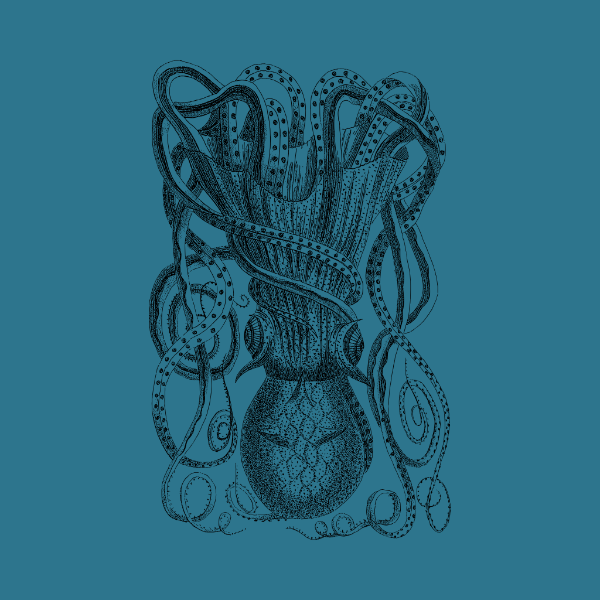

<p align="center">
  
</p>

<h1 align="center">DavyJones</h1>

<p align="center">
  Your Obsidian vault, but it works for you.
</p>

---

## Your Notes, Now With a Crew

DavyJones adds AI agents to your Obsidian vault. Write down what you need done, and agents handle it — research, drafting, organizing, scheduling, communicating across your tools. Your notes stop being static files and start being actionable.

You keep writing in Obsidian the way you always have. DavyJones watches for changes, understands what needs doing, and gets to work. Results appear right back in your vault.

## What Makes This Different

Obsidian is a great place to think. DavyJones makes it a great place to get things done.

- **Your vault becomes a task queue.** Any note can trigger work. Write "research competitors in the CRM space" and commit — an agent picks it up, does the research, and writes the results back into your vault.

- **Agents understand your vault.** They read your existing notes for context. A task about a project pulls in related notes, linked files, and folder structure automatically. No copy-pasting context into a chat window.

- **Everything stays in your vault.** Results, reports, summaries — they all land as markdown files you own. No vendor lock-in, no external dashboards. Your vault is the source of truth.

- **Tasks run in the background.** You don't sit and wait. Submit a task, keep writing, and check the results when they're ready. The Live Tasks view shows progress in real time.

- **Complex work gets broken down automatically.** Big tasks are decomposed into focused sub-tasks that run concurrently. A request like "update all project docs and notify the team on Slack" becomes multiple agents working in parallel.

- **Scheduled tasks run themselves.** Set up recurring agent tasks on a calendar — daily summaries, weekly reviews, Monday morning briefings. They run at the scheduled time without any manual trigger.

- **Works with your existing tools.** Agents can read and post on Slack, create GitHub PRs, manage GitLab issues, query Google Workspace — all from instructions written in plain English in your notes.

## Integrations

| Integration | What Agents Can Do |
|-------------|-------------------|
| **GitHub** | Create branches, open PRs, comment on issues, manage releases, monitor repo activity |
| **GitLab** | Manage merge requests, create issues, work with repositories and CI/CD |
| **Slack** | Read channels, post messages, search conversations, react to messages. Trigger tasks by @mentioning DavyJones |
| **Google Workspace** | Search Gmail, read emails, list Drive files, query Calendar, read Sheets and Docs |
| **DavyJones Calendar** | Schedule one-off or recurring agent tasks, manage events programmatically |

All integrations are optional. Enable them by adding the relevant token in settings — the corresponding service starts automatically.

## Use Cases

### The Professional

*Sarah is a product manager who tracks everything in Obsidian — meeting notes, roadmaps, competitive analysis, stakeholder updates.*

She writes a note before her Monday morning:

> Summarize all Slack messages from #product-team and #engineering from the past week. Pull any open GitHub PRs that are waiting for review. Write a briefing note I can skim in 5 minutes.

She commits and heads to make coffee. When she opens Obsidian ten minutes later, a new briefing note sits in her vault with a Slack digest, PR status table, and key decisions she missed on Friday. She schedules this as a recurring Monday 8am task so it's always ready before standup.

---

### The Personal User

*Marco uses Obsidian as his life dashboard — journal entries, travel plans, reading lists, household projects.*

He creates a note for an upcoming trip:

> I'm traveling to Kyoto from April 10-17. Research the best neighborhoods to stay in, create a day-by-day itinerary with a mix of temples, food spots, and less touristy walks. Add a packing checklist for spring weather in Japan.

The agent creates a structured travel plan with daily breakdowns, links between related notes, and a packing list — all as vault files he can edit and refine. When his plans change, he updates the note and the agent adjusts.

---

### The Athlete

*Lena is a competitive triathlete who logs training, nutrition, and race prep in Obsidian.*

She has a weekly recurring task every Sunday evening:

> Review my training log entries from this week. Calculate total swim/bike/run volume. Compare against my 12-week plan targets. Flag any sessions I missed or where intensity was below target. Write a weekly summary with recommendations for next week's focus.

Every Sunday at 7pm, an agent reads her daily logs, crunches the numbers, and produces a training review note. It catches that she skipped Thursday's interval session and suggests doubling the intensity on Tuesday to stay on track for her half-iron distance race.

---

### The Developer

*James maintains several open-source projects and uses Obsidian to track contributions, decisions, and documentation.*

He writes a task in his vault:

> Go through all open issues on our GitHub repo tagged "good first issue". For each one, check if there's already a linked PR. If not, write a comment with a suggested approach and tag it "needs-contributor". Update my vault's contributor pipeline note with the current status of each issue.

Agents fan out across the issues — one per issue — checking PR links, posting helpful comments on GitHub, and updating a status table in his vault. What would have taken an hour of tab-switching happens while he's writing code.

## Getting Started

### Prerequisites

- [Docker](https://docs.docker.com/get-docker/) with Docker Compose
- [Obsidian](https://obsidian.md/)
- [Claude Code CLI](https://docs.anthropic.com/en/docs/claude-code) (`npm install -g @anthropic-ai/claude-code`)
- A Claude authentication token (`claude setup-token`)

### Install

```bash
git clone https://github.com/andreiRadu1303/DavyJones.git
cd DavyJones

claude setup-token

./davyjones setup /path/to/your/vault
```

### Configure

Add your Claude token in one of two ways:
- Edit `.davyjones.env` in your vault root
- Or in Obsidian: Settings > DavyJones > paste token > Apply Changes

Optional integrations (GitHub, Slack, GitLab, Google Workspace) are configured the same way — just add the relevant tokens.

### Run

```bash
./davyjones start
```

A terminal opens with live logs. Open Obsidian, write something, commit, and watch it work.

| Command | What it does |
|---------|-------------|
| `./davyjones setup [vault]` | Install plugin and configure vault |
| `./davyjones start` | Start all services |
| `./davyjones start --here` | Start in current terminal |
| `./davyjones stop` | Stop services |
| `./davyjones logs` | Tail service logs |
| `./davyjones clean` | Remove all containers and images |

## Architecture

See [ARCHITECTURE.md](ARCHITECTURE.md) for technical details — component breakdown, data flow, MCP servers, HTTP API, configuration reference, and project structure.

## License

This project is licensed under the [GNU General Public License v3.0](LICENSE).
